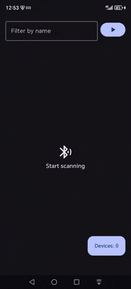
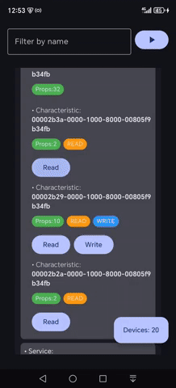

# BLEScanner

An Android app to scan, connect, and interact with Bluetooth Low Energy (BLE) devices. Built with **Kotlin** and **Jetpack Compose**.

---

## Features

- Scan for nearby BLE devices
- Connect and disconnect devices
- Read, write, and subscribe to characteristics
- View device information (address, RSSI, services, manufacturer data)
- Filter devices by name
- Real-time notifications for subscribed characteristics

---

## Video Showcase

<table>
  <tr>
    <td></td>
    <td></td>
  </tr>
</table>
---

## Architecture

- **MVVM pattern** with ViewModel and StateFlow
- **Koin** for dependency injection
- **Jetpack Compose** for UI
- BLE operations handled via `ScannerRepository`

---

## Usage

1. Clone the repository:

```bash
git clone https://github.com/pluzarev-nemanja/BLEScanner.git
```

2. Open in Android Studio and build the project
3. Grant necessary permissions (Location & Bluetooth)
4. Enable Bluetooth if disabled
5. Start scanning for nearby devices
6. Connect to a device and interact with its services and characteristics

---

## Permissions

The app requires the following permissions:

- `BLUETOOTH_SCAN` / `BLUETOOTH_CONNECT`
- `ACCESS_FINE_LOCATION` (for BLE scanning on some devices)

---

## BLE Interactions

- **Read characteristic:** Fetch data from the device
- **Write characteristic:** Send data to the device
- **Subscribe / Unsubscribe:** Receive real-time notifications

> The app logs BLE events and characteristic responses for debugging and inspection.

---

## Dependencies

- Kotlin
- Jetpack Compose
- Koin for DI
- Android BLE APIs

---

## License

MIT License © [Nemanja Pluzarev]